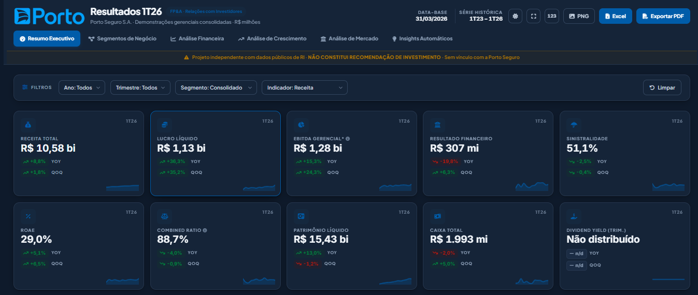

# 📊 Porto Seguro Financial Dashboard

## Overview

Personal project developed to explore how Generative AI can support FP&A and Financial Analysis activities.

Using public Investor Relations data from Porto Seguro, I created an interactive HTML dashboard that transforms a traditional financial release into a more dynamic analytical experience.

## Objectives

- Explore the application of AI in FP&A
- Improve financial storytelling
- Transform public financial data into actionable insights
- Create a modern and interactive analytical experience

## Features

- Executive KPIs
- Income Statement Analysis (DRE)
- Business Segment Analysis
- Combined Ratio Monitoring
- Interactive Charts
- Responsive Layout

## Technologies

- HTML
- CSS
- JavaScript
- Chart.js
- Python
- Generative AI

## Data Source

Public data available through Porto Seguro Investor Relations.

## Disclaimer

This is a personal project developed exclusively for study purposes using publicly available information.

It has no affiliation with Porto Seguro.

## 🚀 Live Demo

👉 https://andremleite.github.io/FPA-dashboard-porto-seguro/
